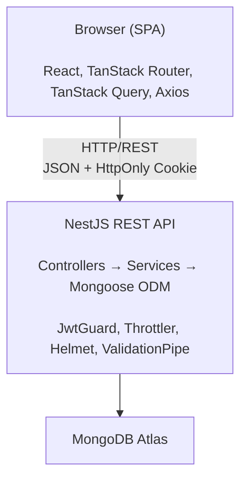
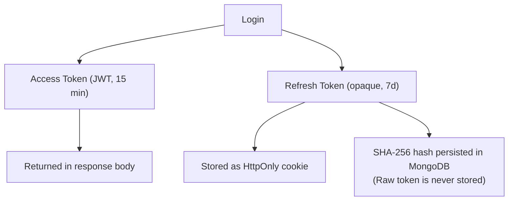

# IdeaVault

A full-stack idea management system demonstrating production-grade software engineering across the entire stack — from API security architecture to frontend data-flow patterns.

> **Stack:** NestJS, MongoDB, React, TanStack Router & Query, shadcn/ui, Tailwind CSS v4, pnpm Workspaces.

---

## Table of Contents

- [Project Overview](#project-overview)
- [System Architecture](#system-architecture)
  - [Project Structure](#project-structure)
- [Backend Architecture](#backend-architecture)
- [Frontend Architecture](#frontend-architecture)
- [Authentication Design](#authentication-design)
- [Testing Strategy](#testing-strategy)
- [Engineering Decisions](#engineering-decisions)

---

## Project Overview

IdeaVault is a platform where users can capture, browse, and manage startup ideas. Unauthenticated visitors can explore all public ideas; authenticated users can create, edit, and delete their own.

---

## System Architecture



The backend exposes a REST API. The frontend is a fully client-side React SPA served statically (no SSR). Cross-origin credentials are sent via `withCredentials: true` on Axios, and the backend explicitly allows the configured frontend origin with `credentials: true` in CORS options.

### Project Structure

```
idea-vault/                     # pnpm workspace root
├── package.json                # Root scripts: dev:api, dev:web, test:api:e2e
├── pnpm-workspace.yaml         # Declares [api, web] as workspace packages
│
├── api/                        # NestJS backend
│   ├── src/
│   │   ├── main.ts
│   │   ├── seed.ts
│   │   ├── app/
│   │   ├── app-config/
│   │   ├── auth/
│   │   ├── ideas/
│   │   └── users/
│   ├── test/                   # E2E test suites
│   ├── ARCHITECTURE.md         # Detailed backend architecture doc
│   ├── .env.example
│   ├── nest-cli.json
│   └── tsconfig.json
│
└── web/                        # React + Vite frontend
    ├── src/
    │   ├── app/
    │   ├── features/
    │   ├── pages/
    │   ├── routes/
    │   └── shared/
    ├── ARCHITECTURE.md         # Detailed frontend architecture doc
    ├── components.json         # shadcn/ui configuration
    ├── vite.config.ts
    └── tsconfig.app.json
```

---

## Backend Architecture

```
src/
├── main.ts                 # Bootstrap: Helmet, CORS, prefix, pipes, cookies
├── seed.ts                 # Standalone seed script (ts-node entry)
│
├── app/                    # Root module + global wiring
│   └── app.module.ts       # Composes all feature modules; registers ThrottlerGuard globally
│
├── app-config/             # Typed configuration module
│   ├── app-config.module.ts
│   ├── app-config.service.ts   # Typed getters: .appOptions, .authOptions
│   └── config/
│       └── app-config.ts       # ConfigFactory — maps env vars to typed classes
│
├── users/
│   ├── users.module.ts
│   ├── users.service.ts        # CRUD + duplicate email handling + bootstrap admin
│   ├── schemas/user.schema.ts
│   └── types/
│
├── auth/
│   ├── auth.module.ts
│   ├── auth.controller.ts      # POST /auth/{register,login,refresh,logout}
│   ├── auth.service.ts         # register, login, refresh, logout orchestration
│   ├── refresh-token.service.ts  # Token lifecycle: create, validate, rotate, revoke
│   ├── strategies/jwt.strategy.ts
│   ├── guards/{jwt,optional-jwt}.guard.ts
│   ├── decorators/get-user.decorator.ts
│   ├── schemas/refresh-token.schema.ts
│   └── types/
│
└── ideas/
    ├── ideas.module.ts
    ├── ideas.controller.ts     # GET /ideas, GET /ideas/me, POST, PUT, DELETE
    ├── ideas.service.ts        # CRUD with userId ownership filter
    ├── schemas/idea.schema.ts
    └── types/dtos/
```

The full backend architecture is documented in [`api/ARCHITECTURE.md`](./api/ARCHITECTURE.md).

---

## Frontend Architecture

The frontend follows a **pragmatic 4-layer Feature-Sliced Design (FSD)** architecture.

```
src/
├── app/
│   ├── layouts/          # RootLayout, AuthenticatedLayout
│   ├── providers/        # Composed React context providers
│   ├── index.css         # Global Tailwind v4 styles + CSS variables
│   ├── main.tsx          # ReactDOM.createRoot entry
│   └── router.ts         # TanStack Router instance
│
├── features/
│   ├── auth/
│   │   ├── auth-context.tsx     # AuthProvider + useAuth hook
│   │   ├── auth-api.ts          # login, register, refresh, logout calls
│   │   ├── auth-schemas.ts      # Zod schemas for login/register forms
│   │   ├── auth-types.ts        # User, AuthContextValue types
│   │   ├── LoginForm.tsx
│   │   └── RegisterForm.tsx
│   └── ideas/
│       ├── ideas-api.ts         # getIdeas, getIdea, createIdea, updateIdea, deleteIdea
│       ├── ideas-queries.ts     # TanStack Query queryKey factory
│       ├── ideas-schemas.ts     # Zod schema + IdeaFormValues type
│       ├── ideas-types.ts       # Idea type
│       ├── IdeaCard.tsx
│       ├── IdeaFormFields.tsx
│       ├── CreateIdeaForm.tsx
│       └── EditIdeaForm.tsx
│
├── pages/
│   ├── HomePage.tsx
│   ├── IdeasListPage.tsx
│   ├── IdeaDetailPage.tsx
│   ├── CreateIdeaPage.tsx
│   ├── EditIdeaPage.tsx
│   ├── ProfilePage.tsx
│   ├── LoginPage.tsx
│   └── RegisterPage.tsx
│
├── routes/               # TanStack Router — thin wrappers only
│   ├── __root.tsx
│   ├── index.tsx
│   ├── _auth.tsx  /  _auth.login.tsx  /  _auth.register.tsx
│   ├── _authenticated.tsx  /  _authenticated.profile.tsx
│   ├── _authenticated.ideas.new.tsx
│   ├── _authenticated.ideas.$ideaid.edit.tsx
│   ├── ideas.index.tsx
│   └── ideas.$ideaid.index.tsx
│
└── shared/
    ├── api/api-client.ts    # Axios instance + module-scope token variable
    ├── config/              # React Query client setup
    ├── hooks/               # Generic hooks (e.g., use-mobile)
    ├── lib/                 # Utility functions
    ├── types/               # Global types (RouterContext)
    └── ui/                  # shadcn/ui components
```

The full frontend architecture is documented in [`web/ARCHITECTURE.md`](./web/ARCHITECTURE.md).

---

## Authentication Design

This is the most technically interesting part of the project. The implementation goes beyond a basic JWT setup.

### Token Architecture



**Why this split?** Access tokens are short-lived and stateless — the server validates them with no DB lookup. Refresh tokens are long-lived and stateful — each one is tracked in the DB to enable revocation.

### Refresh Token Rotation

Every call to `POST /auth/refresh`:

1. Validates the incoming raw token against its SHA-256 hash in the DB.
2. Marks the old token record as **consumed** (`revokedAt = now`, `replacedByTokenHash = newHash`).
3. Creates a new token record **within the same `sessionId`**.
4. Returns a new access token + sets a new refresh token cookie.

This creates a **linked chain** of token records — the rotation history is fully auditable.

### Reuse Detection (Token Family Revocation)

If a previously-consumed token is presented again, the system detects an active session compromise and **immediately revokes all tokens sharing the same `sessionId`**, logging the user out of all devices in that session family.

```
Token A → consumed → replaced by Token B (same sessionId)
Token A presented again → REUSE DETECTED → revoke Token A + Token B
```

### Frontend Token Management

The `AuthContext` manages the token lifecycle on the client:

- **`useLayoutEffect`** registers Axios request/response interceptors **once** before any child renders fire. This avoids race conditions during initial load.
- A **module-level variable** (`let accessToken`) stores the token synchronously. The Axios request interceptor reads this variable — not React state — so it is always current without async lookups.
- On 401 responses, the interceptor **deduplicates concurrent refresh calls** using a shared `refreshPromise`. Multiple simultaneous failed requests share one refresh, then replay.
- On app load, `AuthContext` silently calls `POST /auth/refresh` to restore session state without requiring the user to log in again.

---

## Testing Strategy

### Approach

All automated tests are **end-to-end (e2e)**. Each test suite spins up a full `NestApplication` against a **dedicated test database** (`TEST_DB_URL`), which is dropped and re-indexed in `beforeAll`. This means:

- Tests verify real HTTP behaviour (status codes, headers, cookies, body shape).
- Database side effects are asserted directly via injected Mongoose models.
- No mocking of services or repositories — the entire application stack is exercised.

### Frameworks

| Tool                                  | Role                                              |
| ------------------------------------- | ------------------------------------------------- |
| [Jest](https://jestjs.io/)            | Test runner and assertion library                 |
| [Pactum](https://pactumjs.github.io/) | Fluent HTTP spec library for clean test authoring |

### Test Coverage

| Suite      | File                     | Cases |
| ---------- | ------------------------ | ----- |
| Auth       | `test/auth.e2e-spec.ts`  | ~50   |
| Ideas      | `test/ideas.e2e-spec.ts` | ~40   |
| Users      | `test/users.e2e-spec.ts` | ~10   |
| App health | `test/app.e2e-spec.ts`   | Smoke |

### Test Categories per Endpoint

Each endpoint is tested across four lenses:

| Lens                 | What it verifies                                          |
| -------------------- | --------------------------------------------------------- |
| **Input validation** | Malformed / missing fields → 400                          |
| **Authentication**   | Missing / invalid token → 401                             |
| **Business logic**   | Correct status codes and body shape on happy + sad paths  |
| **Side effects**     | DB state assertions (token creation, hashing, revocation) |

### Notable Side-Effect Assertions

- Registration persists passwords as Argon2 hashes (not plaintext) — verified by reading the DB directly.
- Login failure does **not** create any refresh token records — confirmed by document-count comparison before and after.
- Refresh token reuse triggers session-family revocation — the entire token chain is verified as `revokedAt != null`.
- Logout correctly marks tokens revoked in the DB; an invalid-token logout does **not** alter other active sessions.

### ThrottlerGuard in Tests

The global `ThrottlerGuard` is applied as an `APP_GUARD`. In e2e tests, it is bypassed cleanly with a `jest.spyOn` mock — no production code changes, no special test module overrides.

---

## Engineering Decisions

### Why Opaque Refresh Tokens (not JWT refresh tokens)?

JWT refresh tokens cannot be revoked without a server-side lookup. Using an opaque token with a hashed DB record enables:

- Single-token revocation on logout
- Session-family revocation on reuse detection
- A full audit trail via the `replacedByTokenHash` chain

### Why Feature-Sliced Design on the Frontend?

FSD enforces a unidirectional dependency graph (`app → pages → features → shared`). This prevents the "component spaghetti" problem common in large React projects, where components import freely from each other creating hidden coupling. The pragmatic 4-layer reduction keeps the overhead manageable for a project of this scale.

### Why E2E Tests over Unit Tests?

For a REST API, e2e tests give the highest confidence with the least surface area to maintain. Unit-testing services in isolation requires mocking Mongoose models and NestJS providers — boilerplate that often ends up testing the mocks rather than real behaviour. Testing against a real database verifies the full stack, including indexes, schema validation, and Mongoose middleware.

---

## Development Setup

### Prerequisites

- **Node.js** ≥ 22
- **pnpm** ≥ 10 (`npm install -g pnpm`)
- A **MongoDB** instance (local or [MongoDB Atlas](https://www.mongodb.com/atlas))

### 1. Clone and install

```bash
git clone https://github.com/belall0/idea-vault
cd idea-vault
pnpm install
```

### 2. Configure the API

```bash
cp api/.env.example api/.env
```

Edit `api/.env`:

```env
NODE_ENV=development
CREATE_DEFAULT_ADMIN=true
DB_URL=mongodb://localhost:27017/idea-vault
TEST_DB_URL=mongodb://localhost:27017/idea-vault-test
FRONTEND_URL=http://localhost:5173
```

> `CREATE_DEFAULT_ADMIN=true` creates a default user (`belal@gmail.com` / `Idea@2026`) on first boot in non-production environments.

### 3. Configure the frontend

```bash
cp web/.env.example web/.env
```

Edit `web/.env`:

```env
VITE_API_URL=http://localhost:3000
```

### 4. Start development servers

```bash
# Terminal 1 — API (port 3000, --watch mode)
pnpm dev:api

# Terminal 2 — Web (port 5173, HMR)
pnpm dev:web
```

### 5. Seed the database (optional)

```bash
cd api

# Add seed data (idempotent — safe to re-run)
pnpm seed

# Wipe collections and re-seed from scratch
pnpm seed:reset
```

### 6. Run e2e tests

```bash
pnpm test:api:e2e
```

Ensure `TEST_DB_URL` points to a **separate** database from `DB_URL` — the test suite drops the entire database in `beforeAll`.

---
