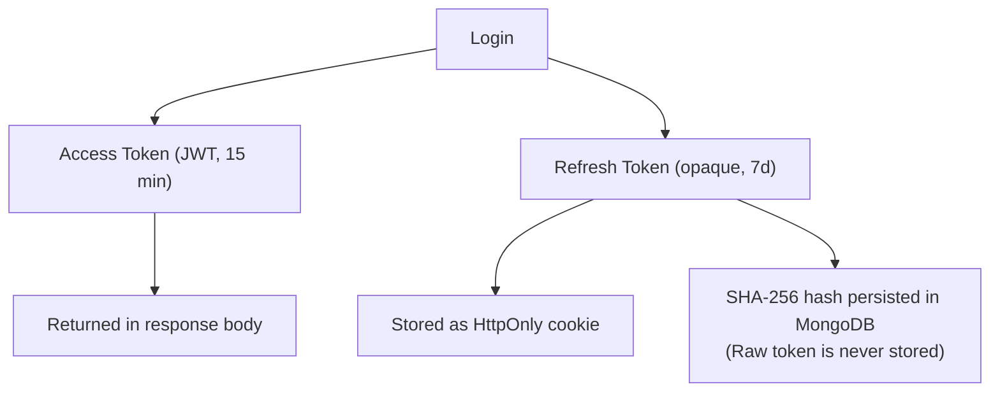

# Authentication Design

This document details the authentication and authorization design in IdeaVault, including token architecture, refresh token rotation, reuse detection, and client-side session management.

---

## Token Architecture



### Why this split?

- **Access tokens** are short-lived (15 minutes) and stateless — the server validates them via JWT signature with no DB lookup.
- **Refresh tokens** are long-lived (7 days) and stateful — each one is tracked in MongoDB to enable granular revocation.

---

## Refresh Token Rotation

Every call to `POST /auth/refresh`:

1. Validates the incoming raw token against its SHA-256 hash in the DB.
2. Marks the old token record as **consumed** (`revokedAt = now`, `replacedByTokenHash = newHash`).
3. Creates a new token record **within the same `sessionId`**.
4. Returns a new access token and sets a new refresh token cookie.

This creates a **linked chain** of token records — the rotation history is fully auditable.

---

## Reuse Detection (Token Family Revocation)

If a previously-consumed token is presented again, the system detects an active session compromise and **immediately revokes all tokens sharing the same `sessionId`**, logging the user out of all devices in that session family.

```text
Token A → consumed → replaced by Token B (same sessionId)
Token A presented again → REUSE DETECTED → revoke Token A + Token B
```

---

## Frontend Token Management

The `AuthContext` manages the token lifecycle on the client:

- **`useLayoutEffect`** registers Axios request/response interceptors **once** before any child renders fire. This avoids race conditions during initial load.
- A **module-level variable** (`let accessToken`) stores the token synchronously. The Axios request interceptor reads this variable — not React state — so it is always current without async lookups.
- On 401 responses, the interceptor **deduplicates concurrent refresh calls** using a shared `refreshPromise`. Multiple simultaneous failed requests share one refresh, then replay.
- On app load, `AuthContext` silently calls `POST /auth/refresh` to restore session state without requiring the user to log in again.
